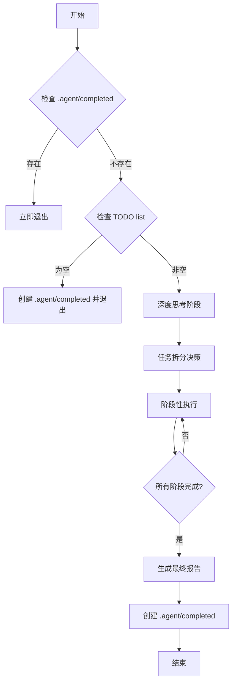

# AI Agent 执行流程规范

## 快速入门

### 执行流程图



---

## 1️⃣ 检查完成标记

### 检查 `.agent/completed` 文件

```bash
# 检查文件是否存在
if [ -f .agent/completed ]; then
    echo "✅ 任务已完成，退出执行"
    exit 0
fi
```

**规则**：
- 如果 `.agent/completed` 存在，立即退出
- 防止重复执行已完成的任务
- 该文件可随时删除以重新触发执行

### 检查 TODO list

```bash
# 检查 TODO list 是否为空
if [ -z "$TODO_LIST" ]; then
    echo "✅ TODO list 为空，创建完成标记"
    echo "$(date)" > .agent/completed
    exit 0
fi
```

**规则**：
- 如果 TODO list 为空，创建 `.agent/completed` 并退出
- 无任务时不执行任何操作

---

## 2️⃣ 深度思考阶段

### 调用 Sequential Thinking MCP

**必须先进行深度思考，再执行任务**。

#### 思考内容

1. **澄清任务本质**：
   - 任务的核心目标是什么？
   - 需要解决什么问题？
   - 预期的输出是什么？

2. **分析依赖关系**：
   - 任务之间有哪些依赖？
   - 哪些任务必须串行执行？
   - 哪些任务可以并行执行？

3. **规划执行策略**：
   - 如何拆分任务？
   - 如何分配资源？
   - 如何处理错误？

#### 输出思考结果

将思考结果保存到 `.agent/thinking.md`。

---

## 3️⃣ 任务拆分决策

### 分析任务是否可以拆分

#### 可以拆分的条件

1. **无数据依赖**：任务之间不共享数据
2. **无顺序依赖**：任务执行顺序不影响结果
3. **无资源冲突**：任务不竞争同一资源（文件、网络等）

#### 拆分策略

**如果可以拆分**：
```markdown
## 任务拆分决策

**决策**：可以拆分

**拆分方案**：
- SubAgent-1：安全漏洞审查
- SubAgent-2：内存安全审查
- SubAgent-3：错误处理审查
- SubAgent-4：并发安全审查

**并行执行**：4 个子任务并行执行

**汇总方式**：所有子任务完成后，合并结果
```

**如果不可拆分**：
```markdown
## 任务拆分决策

**决策**：不可拆分

**原因**：
- 任务之间存在数据依赖
- 任务 B 需要任务 A 的输出

**执行方式**：串行执行
```

### 记录拆分决策

将拆分决策保存到 `.agent/task_plan.md`。

---

## 4️⃣ 阶段性执行

### 按优先级顺序执行

**执行顺序**：P0 → P1 → P2 → P3

#### 阶段内并行执行

```python
# 伪代码示例
async def execute_stage(stage_name, tasks):
    print(f"开始执行 {stage_name}")
    
    # 并行执行所有任务
    results = await asyncio.gather(*[
        execute_task(task) for task in tasks
    ])
    
    # 检查是否所有任务都成功
    if all(result.success for result in results):
        print(f"✅ {stage_name} 完成")
        update_progress(stage_name, "completed")
    else:
        print(f"❌ {stage_name} 失败")
        handle_errors(results)
    
    return results
```

### 每个子任务完成后立即运行测试

```bash
# 子任务完成后的验证流程
function verify_task_completion() {
    local task_name=$1
    
    echo "验证任务：$task_name"
    
    # 运行测试
    cargo test --workspace --all-features
    if [ $? -ne 0 ]; then
        echo "❌ 测试失败"
        return 1
    fi
    
    # 运行 Clippy
    cargo clippy --workspace --all-targets --all-features -- -D warnings
    if [ $? -ne 0 ]; then
        echo "❌ Clippy 检查失败"
        return 1
    fi
    
    echo "✅ 任务验证通过"
    return 0
}
```

### 每个阶段完成后更新进度

更新 `.agent/task.md`。

---

## 5️⃣ 完成检查

### 生成最终报告

所有阶段完成后，合并所有阶段性报告，生成最终报告：

```bash
# 生成最终报告
function generate_final_report() {
    echo "生成最终报告..."
    
    # 合并所有阶段性报告
    cat .agent/review_*.md > .agent/code_review_report.md
    
    # 添加执行摘要
    add_executive_summary
    
    # 添加统计分析
    add_statistics
    
    echo "✅ 最终报告已生成：.agent/code_review_report.md"
}
```

### 创建完成标记

```bash
# 创建完成标记文件
echo "$(date)" > .agent/completed
echo "✅ 任务已完成"
```

---

## 📁 `.agent/` 目录管理规范

### 目录结构

```
.agent/
├── completed                    # 完成标记文件（临时）
├── thinking.md                  # 深度思考记录
├── task_plan.md                 # 任务执行计划
├── task.md                      # 任务进度追踪
├── review_security.md           # 安全审查报告
├── review_memory.md             # 内存安全审查报告
├── code_review_report.md        # 最终完整报告
├── test_report.md               # 测试报告
├── test_failures.log            # 测试失败日志
└── errors.log                   # 错误日志
```

### 目录管理规则

**严格禁止加入 `.gitignore`**：
- `.agent/` 目录下的所有文件（除 `completed`）都是重要的计划和进度文件
- 这些文件必须提交到 Git 仓库，便于追踪和审查
- `completed` 文件仅作为执行标记，可随时删除重新触发

**文件命名规范**：
- 使用小写字母和下划线
- 使用 `.md` 扩展名（Markdown 格式）
- 使用 `.log` 扩展名（日志文件）

---

## 🔧 工作规范

### 1. 使用 `.agent/` 存储计划和进度追踪

所有任务相关的文档都保存在 `.agent/` 目录：
- 思考记录
- 执行计划
- 进度追踪
- 审查报告
- 测试报告
- 错误日志

### 2. 优先使用 MCP 和子代理处理独立任务

**使用 MCP**：
- `sequential-thinking`：深度思考
- `context7`：代码上下文分析
- `grep`：代码搜索
- `deepwiki`：技术文档查询

**使用子代理**：
- 并行执行独立任务
- 提高执行效率
- 避免单点故障

### 3. 原子化变更，最小化修改范围

**原则**：
- 每个任务只做一件事
- 每个提交只包含相关的变更
- 避免一次性修改过多文件

### 4. 每个任务独立提交，便于问题定位和回滚

**提交策略**：
- 每完成一个子任务，立即提交
- 提交信息清晰、具体
- 便于回滚和问题定位

---

## ⚠️ 错误处理

### 记录错误

所有错误都记录到 `.agent/errors.log`：

```
[2025-12-02 15:30:00] ERROR
任务：安全漏洞审查
错误：cargo audit 执行失败
详情：依赖 tokio 1.20.0 存在安全漏洞
解决：更新 tokio 到 1.35.0
```

### 错误处理策略

1. **测试失败**：记录失败信息、分析原因、回滚或修复
2. **任务失败**：记录失败信息、继续下一任务
3. **超时**：保存当前进度、提交已完成的部分

---

## ⏱️ 执行约束

### 时间限制

- **总时间限制**：6 小时
- **单个任务限制**：30 分钟
- **超时处理**：提交已完成工作并退出

### 任务范围限制

- **不要添加 TODO 外的任务**
- **不要执行标记为"不执行"的高风险任务**
- **严格按照 TODO list 执行**

---

## 参考资料

详见 [ERROR_HANDLING.md](ERROR_HANDLING.md) 了解错误处理的详细说明。

---

**版本**：2.0.0（符合官方 Agent Skills 规范）  
**最后更新**：2025-12-02
