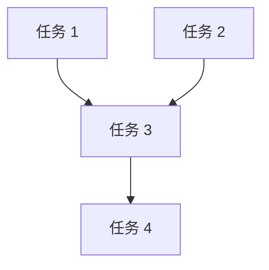
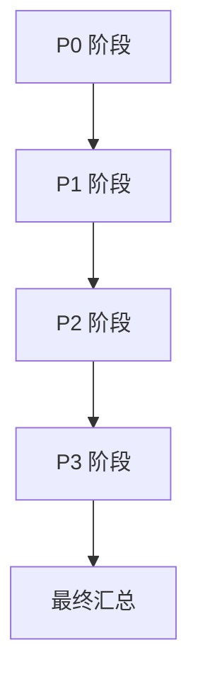

# 进度追踪文件模板

## 快速入门

### 文件模板总览

| 文件名 | 用途 | 格式 |
|--------|------|------|
| `task.md` | 任务进度追踪 | Markdown |
| `thinking.md` | 深度思考记录 | Markdown |
| `task_plan.md` | 任务执行计划 | Markdown |
| `test_report.md` | 测试报告 | Markdown |
| `test_failures.log` | 测试失败日志 | 纯文本 |
| `errors.log` | 错误日志 | 纯文本 |
| `completed` | 完成标记 | 纯文本 |

---

## 1️⃣ 任务进度追踪（`task.md`）

### 模板

```markdown
# 代码审查任务进度

**开始时间**：[YYYY-MM-DD HH:MM:SS]
**当前阶段**：[P0/P1/P2/P3] - [阶段名称]
**总体进度**：[XX]% ([已完成]/[总数] 维度已完成)

---

## P0 任务进度（[已完成]/[总数] [状态]）

- [x] 安全漏洞审查 - 完成时间：[YYYY-MM-DD HH:MM:SS] - 报告：`.agent/review_security.md`
- [x] 内存安全审查 - 完成时间：[YYYY-MM-DD HH:MM:SS] - 报告：`.agent/review_memory.md`
- [x] 错误处理审查 - 完成时间：[YYYY-MM-DD HH:MM:SS] - 报告：`.agent/review_errors.md`
- [x] 并发安全审查 - 完成时间：[YYYY-MM-DD HH:MM:SS] - 报告：`.agent/review_concurrency.md`

**阶段状态**：✅ 已完成

---

## P1 任务进度（[已完成]/[总数] [状态]）

- [ ] 逻辑错误 - 报告：`.agent/review_logic.md`
- [ ] 算法复杂度评估 - 报告：`.agent/review_performance.md`
- [ ] 架构设计审查 - 报告：`.agent/review_architecture.md`
- [ ] 数据流分析 - 报告：`.agent/review_dataflow.md`

**阶段状态**：🔄 进行中

---

## 测试验证状态

- [x] P0 阶段测试通过 - [YYYY-MM-DD HH:MM:SS]
- [ ] P1 阶段测试
- [ ] P2 阶段测试
- [ ] P3 阶段测试

---

## 执行统计

- **总耗时**：[XX] 小时 [XX] 分钟
- **已完成任务**：[XX] 个
- **待完成任务**：[XX] 个
- **发现问题**：[XX] 个（🔴 [XX] 高 / 🟡 [XX] 中 / 🟢 [XX] 低）

---

**最后更新**：[YYYY-MM-DD HH:MM:SS]
```

### 示例

```markdown
# 代码审查任务进度

**开始时间**：2025-12-02 15:00:00
**当前阶段**：P1 - 重要优化
**总体进度**：25% (4/17 维度已完成)

---

## P0 任务进度（4/4 已完成）

- [x] 安全漏洞审查 - 完成时间：2025-12-02 15:30:00 - 报告：`.agent/review_security.md`
- [x] 内存安全审查 - 完成时间：2025-12-02 15:30:00 - 报告：`.agent/review_memory.md`
- [x] 错误处理审查 - 完成时间：2025-12-02 15:30:00 - 报告：`.agent/review_errors.md`
- [x] 并发安全审查 - 完成时间：2025-12-02 15:30:00 - 报告：`.agent/review_concurrency.md`

**阶段状态**：✅ 已完成

---

## 执行统计

- **总耗时**：0 小时 35 分钟
- **已完成任务**：4 个
- **待完成任务**：13 个
- **发现问题**：12 个（🔴 3 高 / 🟡 5 中 / 🟢 4 低）

---

**最后更新**：2025-12-02 15:35:00
```

---

## 2️⃣ 深度思考记录（`thinking.md`）

### 模板

```markdown
# 深度思考记录

**思考时间**：[YYYY-MM-DD HH:MM:SS]
**任务概述**：[简要描述任务]

---

## 任务本质分析

### 核心目标
[分析任务的核心目标]

### 需求分析
[分析具体需求]

### 预期输出
[描述预期的输出结果]

---

## 依赖关系分析

### 任务依赖图


### 依赖说明
- **无依赖任务**：[列出可并行执行的任务]
- **有依赖任务**：[列出必须串行执行的任务]
- **依赖关系**：[详细说明依赖关系]

---

## 执行策略

### 阶段划分
- **阶段 1**：[阶段名称] - [任务列表]
- **阶段 2**：[阶段名称] - [任务列表]
- **阶段 3**：[阶段名称] - [任务列表]

### 资源分配
- **SubAgent-1**：[负责的任务]
- **SubAgent-2**：[负责的任务]
- **主 Agent**：[负责的任务]

### 错误处理
- **失败策略**：[任务失败时的处理策略]
- **回滚机制**：[如何回滚变更]
- **重试机制**：[是否重试，重试几次]

---

**思考结论**：[总结思考结果，明确执行方案]
```

---

## 3️⃣ 任务执行计划（`task_plan.md`）

### 模板

```markdown
# 任务执行计划

**计划时间**：[YYYY-MM-DD HH:MM:SS]
**计划版本**：v1.0

---

## 任务列表

| 任务 ID | 任务名称 | 优先级 | 执行方式 | 负责人 | 预计耗时 | 状态 |
|---------|---------|--------|---------|--------|---------|------|
| T1 | [任务名称] | P0 | 并行 | SubAgent-1 | 30 分钟 | ⏸️ 未开始 |
| T2 | [任务名称] | P0 | 并行 | SubAgent-2 | 30 分钟 | ⏸️ 未开始 |
| T3 | [任务名称] | P0 | 并行 | SubAgent-3 | 30 分钟 | ⏸️ 未开始 |
| T4 | [任务名称] | P0 | 并行 | SubAgent-4 | 30 分钟 | ⏸️ 未开始 |

---

## 执行顺序

### 阶段 1：P0 阶段（并行执行）
- **任务**：T1, T2, T3, T4
- **执行方式**：并行
- **预计总耗时**：30 分钟
- **完成标准**：所有 4 个子报告已生成，测试通过

---

## 依赖关系



---

## 时间规划

| 阶段 | 开始时间 | 结束时间 | 耗时 |
|------|---------|---------|------|
| P0 | 15:00:00 | 15:30:00 | 30 分钟 |
| P1 | 15:30:00 | 16:00:00 | 30 分钟 |
| P2 | 16:00:00 | 16:30:00 | 30 分钟 |
| P3 | 16:30:00 | 17:00:00 | 30 分钟 |
| 最终汇总 | 17:00:00 | 17:15:00 | 15 分钟 |
| **总计** | | | **2 小时 15 分钟** |

---

**计划状态**：✅ 已确认
```

---

## 4️⃣ 测试报告（`test_report.md`）

### 模板

```markdown
# 测试报告

**测试时间**：[YYYY-MM-DD HH:MM:SS]
**提交哈希**：[Git commit hash]
**测试环境**：[操作系统] / Rust [版本]

---

## 测试结果摘要

| 测试类型 | 通过 | 失败 | 跳过 | 总计 | 通过率 |
|---------|------|------|------|------|--------|
| 单元测试 | XX | XX | XX | XX | XX% |
| 集成测试 | XX | XX | XX | XX | XX% |
| 文档测试 | XX | XX | XX | XX | XX% |
| **总计** | **XX** | **XX** | **XX** | **XX** | **XX%** |

---

## 测试覆盖率

| 模块 | 覆盖率 | 状态 |
|------|--------|------|
| crates/core | XX% | ✅ / ❌ |
| crates/cli | XX% | ✅ / ❌ |
| crates/utils | XX% | ✅ / ❌ |
| **总计** | **XX%** | **✅ / ❌** |

**覆盖率目标**：80%  
**当前覆盖率**：XX%  
**达标状态**：✅ 达标 / ❌ 未达标

---

**测试结论**：✅ 通过 / ❌ 失败
```

---

## 5️⃣ 测试失败日志（`test_failures.log`）

### 格式

```
[时间戳] 测试失败
文件：[修改的文件]
测试：[失败的测试名称]
错误：[错误信息]
堆栈：[堆栈跟踪]
---
```

---

## 6️⃣ 错误日志（`errors.log`）

### 格式

```
[时间戳] ERROR
任务：[任务名称]
错误：[错误类型]
详情：[详细错误信息]
解决：[解决方案]
---
```

---

## 7️⃣ 完成标记（`completed`）

### 格式

```
[完成时间戳]
```

### 示例

```
2025-12-02 17:15:00
```

**说明**：
- 这是一个临时标记文件
- 文件内容仅包含完成时间戳
- 可随时删除以重新触发执行

---

## 参考资料

详见 [TEMPLATES/](TEMPLATES/) 目录了解各种模板的详细示例。

---

**版本**：2.0.0（符合官方 Agent Skills 规范）  
**最后更新**：2025-12-02
