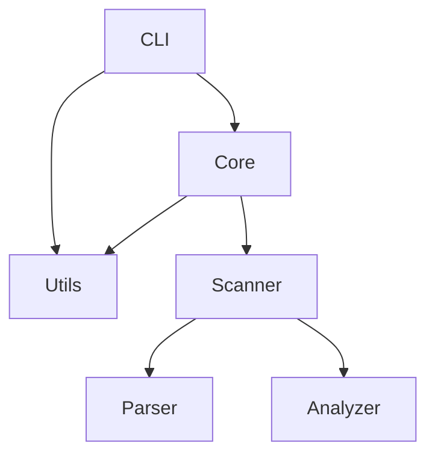

# 最终完整报告模板

保存为：`.agent/code_review_report.md`

---

## 完整报告模板

```markdown
# 代码审查报告

**项目名称**：[项目名称]  
**审查日期**：[YYYY-MM-DD]  
**审查范围**：[描述审查的模块/文件范围]  
**审查人员**：AI Code Reviewer  

---

## 📊 执行摘要

### 总体评分
- **代码质量**：⭐⭐⭐⭐☆ (4/5)
- **安全性**：⭐⭐⭐☆☆ (3/5)
- **性能**：⭐⭐⭐⭐☆ (4/5)
- **可维护性**：⭐⭐⭐☆☆ (3/5)

### 问题统计
| 优先级 | 数量 | 占比 |
|--------|------|------|
| 🔴 高  | X    | XX%  |
| 🟡 中  | X    | XX%  |
| 🟢 低  | X    | XX%  |
| **总计** | **X** | **100%** |

### 关键发现
1. [最重要的发现 1 - 简要描述]
2. [最重要的发现 2 - 简要描述]
3. [最重要的发现 3 - 简要描述]

### 审查覆盖范围
- **P0 阶段**：✅ 已完成（安全漏洞、内存安全、错误处理、并发安全）
- **P1 阶段**：✅ 已完成（逻辑错误、算法复杂度、架构设计、数据流）
- **P2 阶段**：✅ 已完成（冗余代码、可读性、API 设计、最佳实践）
- **P3 阶段**：✅ 已完成（技术债务、过度设计、用户体验、可观测性）

---

## 🔍 详细问题清单

### P0 阶段：核心安全与正确性

#### 1. [问题类别] - [问题标题]

**优先级**：🔴 高  
**影响范围**：[性能/安全/可维护性/用户体验]  
**发现维度**：[对应 17 个审查维度中的哪一个]

##### 问题描述
[清晰描述问题是什么，为什么是问题]

##### 问题位置
```
文件：crates/core/src/scanner/mod.rs
行号：L123-L145
函数：scan_repository()
```

##### 代码示例
```rust
// 当前实现（有问题的代码）
[代码示例]
```

##### 影响分析
- **性能影响**：[具体描述]
- **安全风险**：[具体描述]
- **用户体验**：[具体描述]

##### 修复建议
[详细的修复方案，包括代码示例]

**预期效果**：
- [量化的改进指标]
- 工作量估计：[小时数]

---

## 📈 数据流分析

### 关键数据流图


### 数据流问题汇总
1. **验证缺失**：[位置] 缺少输入验证
2. **数据泄漏**：[位置] 敏感数据未脱敏
3. **转换错误**：[位置] 数据类型转换可能失败

---

## 🏗️ 架构问题

### 模块耦合度分析
```
高耦合模块：
- ModuleA ←→ ModuleB (双向依赖，需解耦)
- ServiceX → 15 个依赖项 (上帝类，需拆分)
```

### 模块依赖图


### SOLID 原则违反
1. **单一职责违反**：`UserService` 同时处理认证、授权、用户管理
2. **开闭原则违反**：添加新支付方式需修改 `PaymentProcessor`
3. **依赖倒置违反**：高层模块直接依赖低层模块的具体实现

---

## 🔒 安全问题汇总

| 问题类型 | 位置 | 风险等级 | 修复状态 |
|----------|------|----------|----------|
| 命令注入 | crates/core/src/git/mod.rs:L45 | 🔴 高 | 待修复 |
| 路径遍历 | crates/core/src/scanner/mod.rs:L78 | 🟡 中 | 待修复 |
| Unsafe 代码 | crates/utils/src/platform.rs:L12 | 🔴 高 | 待审查 |
| 依赖漏洞 | Cargo.toml (tokio 1.20.0) | 🟡 中 | 待更新 |

---

## ⚡ 性能问题汇总

| 问题类型 | 位置 | 当前复杂度 | 优化后 | 性能提升 |
|----------|------|-----------|--------|----------|
| 嵌套循环 | crates/core/src/processor.rs:L234 | O(n²) | O(n) | 100倍 |
| 重复计算 | crates/core/src/analyzer.rs:L89 | O(n·m) | O(n+m) | 10倍 |
| 过度克隆 | crates/utils/src/helpers.rs:L45 | - | 使用借用 | 减少内存分配 |

---

## ✅ 修复优先级路线图

### Phase 1：紧急修复（1-3 天）
- [ ] 🔴 修复命令注入漏洞 (crates/core/src/git/mod.rs:L45)
- [ ] 🔴 修复路径遍历漏洞 (crates/core/src/scanner/mod.rs:L78)
- [ ] 🔴 审查 Unsafe 代码块 (crates/utils/src/platform.rs:L12)
- [ ] 🔴 更新存在漏洞的依赖 (tokio 1.20.0 → 1.35.0)

### Phase 2：重要优化（1-2 周）
- [ ] 🟡 优化 O(n²) 算法 (crates/core/src/processor.rs:L234)
- [ ] 🟡 解耦 ModuleA 和 ModuleB
- [ ] 🟡 添加缺失的错误处理
- [ ] 🟡 重构上帝类 ServiceX

### Phase 3：改进提升（1 个月）
- [ ] 🟢 清理冗余代码
- [ ] 🟢 提升测试覆盖率（当前 65% → 目标 80%）
- [ ] 🟢 改进代码可读性（拆分长函数）
- [ ] 🟢 完善文档注释

---

## 📚 最佳实践建议

1. **代码规范**：建议引入 `cargo clippy` 和 `cargo fmt` 自动化检查
2. **测试策略**：关键业务逻辑测试覆盖率应达到 80%+
3. **文档完善**：所有公共 API 缺少 rustdoc 文档注释
4. **监控增强**：建议添加关键业务指标监控（使用 tracing）
5. **依赖管理**：定期运行 `cargo audit` 检查依赖安全性
6. **性能优化**：使用 `cargo bench` 建立性能基准

---

## 📎 附录

### 审查工具
- **静态分析**：`cargo clippy`
- **依赖检查**：`cargo audit`, `cargo deny`
- **性能分析**：`cargo bench`, `cargo flamegraph`
- **测试覆盖率**：`cargo tarpaulin`

### 参考资料
- [Rust API Guidelines](https://rust-lang.github.io/api-guidelines/)
- [Rust Performance Book](https://nnethercote.github.io/perf-book/)
- [Rust Security Guidelines](https://anssi-fr.github.io/rust-guide/)

### 审查统计
- **审查文件数**：XX 个
- **审查代码行数**：XXXX 行
- **审查耗时**：XX 小时
- **发现问题数**：XX 个

---

**报告版本**：1.0.0  
**生成时间**：[YYYY-MM-DD HH:MM:SS]  
**下次审查建议**：[YYYY-MM-DD]
```

---

**版本**：2.0.0  
**最后更新**：2025-12-02
